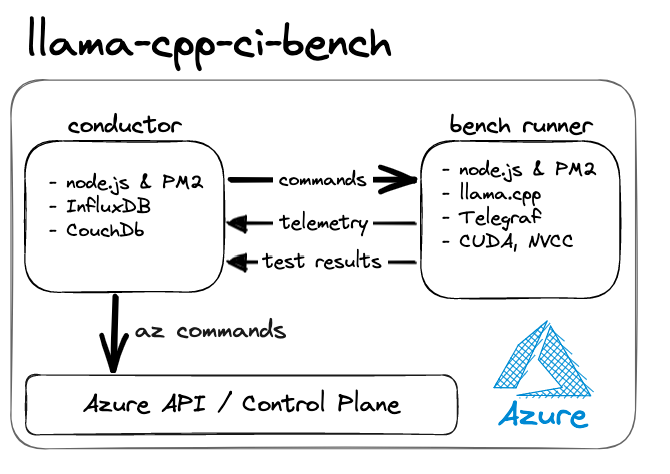

<!-- # llama-cpp-ci-bench -->

### *... Continual integration benchmarking for LLM inference engine **[llama.cpp](https://github.com/ggerganov/llama.cpp)***

 

> ### ⚠️ **WARNING**
> Spinning up GPU virtual machines can get expensive 💰 
> <i>please proceed carefully...</i> 

 

## **About**
ToDo...

 

## **Tech Stack**
- **Azure cloud by Microsoft** - we are targeting MS Azure exclusively (at this point)
- **Azure CLI** - `az` is command line tool to managed Azure infrastructure
- **node.js** - application logic, **[llama.cpp](https://github.com/ggerganov/llama.cpp)** process control and workflow
- **InfluxDB** - logs and metrics time series database (TSDB)
- **Telegraf** - gathers various Benchmark VM metric and sends them to InfluxDb
- **CouchDB** - robust & simple noSQL database (distrubtable)

 

## **Architecture**
<!--  -->
  

### **⚙️ conductor VM**

#### **Conductor Overview**
- always on small cloud VM
- Ubuntu 22.04
- [node.js](https://nodejs.org/en/about)
- [PM2](https://pm2.keymetrics.io/) to manage cron & processes
- [InfluxDB](https://www.influxdata.com/products/influxdb-overview/) for logs & telemetry
- [CouchDB](https://couchdb.apache.org/) for config & bench result summaries
- [Telegraf](https://www.influxdata.com/time-series-platform/telegraf/) to gather machine telemetry
- \[Later] [Grafana](https://grafana.com/) for telemetry visualisation
- \[Later] Python & Jupyter for benchmark data analysis

#### **Conductor Functionality**
1. **polls** Gituhb API periodically for latest llama.cpp release
1. instruct Azure to create a GPU VM using `az` CLI commands

#### **Config database - CouchDB**
- bench test data
- Azure machine image data

#### **Logging Database - InfluxDB**
- llama.cpp stdout stream with timestamps
- nvidia-smi metrics
- cpu, gpu, ram metrics & other machine metrics

 

### **⚙️ bench runner VM**

#### **bench runner overview**
- emphemeral VM
- Ubuntu, Debian or Windows VM
- node.js, nvm & PM2
- nvidia drivers etc
- Telegraf (for machine & nvidia telemetry)

#### **bench runner functionality**
node.js runs a managed node.js sub-process;
1. node.js pulls git code - eg `git pull master-d7d2e6a`
1. node.s builds the code - eg `make clean && make -j`
1. node.js runs **[llama.cpp](https://github.com/ggerganov/llama.cpp)** - eg `time ./perplexity -m ./models/3B/open-llama-3b-q4_0.bin -f build/wiki.test.raw.406 -t 8` 
1. node.js sends `stdout` to 📂 InfuxDB
1. node.js sends llama.cpp process results to 📂 CouchDB
1. *[optionally] node.js switches to a different branch - GOTO #1*
1. node.js sends "bench session end" signal to **⚙️ conductor** / 📂 CouchDB / 📂 InfluxDB
1. node.js shutsdown the VM 

---

 

## **Setup**

ToDO