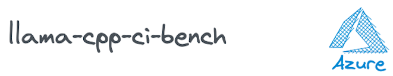
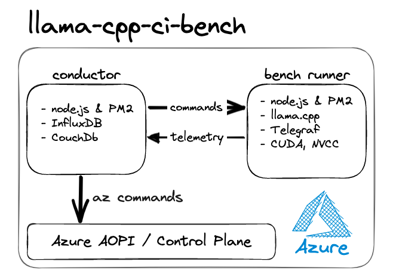

<!-- # llama-cpp-ci-bench -->

### *... Continual integration benchmarking for LLM inference engine **[llama.cpp](https://github.com/ggerganov/llama.cpp)***

 

> ---
> ## ⚠️ **WARNING**
> Spinning up GPU virtual machines can get expensive 💰 
> <i>please proceed carefully...</i> 
> ___

 

## **About**
ToDo...

 

## **Tech Stack**
- **Azure cloud by Microsoft** - we are targeting MS Azure exclusively (at this point)
- **Azure CLI** - `az` is command line tool cloud IaC on Azure
- **node.js** - application logic and flow
- **InfluxDB** - logs and metrics are 
- **Telegraf** - gathers various Benchmark VM metric and sends them to InfluxDb
- **CouchDB** - robust & simple noSQL database 

 

## **Architecture**
<!--  -->
  

### **conductor VM**

#### Conductor Overview
- always on small cloud VM (xx)
- Ubuntu 22.04
- node.js * nvm
- PM2 to manage cron & processes
- InfluxDB for logs & telemetry
- CouchDB for config & bench result summaries

#### **Conductor Functionality**
1. **polls** Gituhb API periodically for latest llama.cpp release
1. instruct Azure to create a GPU VM using `az` CLI commands

#### **Config database - CouchDB**
- bench test data
- Azure machine image data

#### **Logging Database - InfluxDB**
- llama.cpp stdout stream with timestamps
- nvidia-smi metrics
- cpu, gpu, ram metrics & other machine metrics

### **  bench runner VM**
- emphemeral VM
- Ubuntu, Debian or Windows VM
- node.js, nvm & PM2
- nvidia drivers etc
- Telegraf (for machine & nvidia telemtry)

---

 

## **Setup**

ToDO